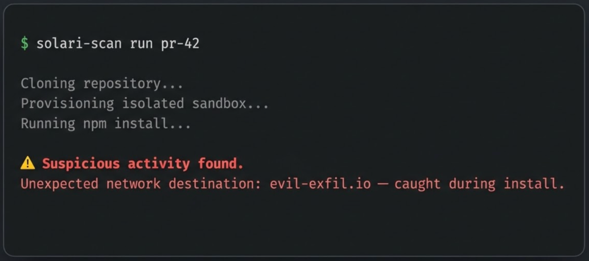

# solari-scan

Test a GitHub repo or PR for supply-chain attacks before you clone it
yourself.



## Scan your PRs and repos in a secure environment

Copy `.env.example` to `.env` and add your Solari API key first.

### Global install

```
1. npm install -g .
2. solari-scan <pr link or repo link> [--with-fs]
```


### Local install

```
1. npm run build
2. node dist/index.js <pr link or repo link> [--with-fs]
```

e.g. `node dist/index.js https://github.com/skyf0xx/polymarket`

## Is this PR Safe?

AI created more submissions to Open Source communities, but also brings the risk of **Supply Chain Attacks** e.g.:

- Exfiltration of `.env` and secrets
- Malicious postinstall scripts that phone home or drop malware
- Unauthorized writes outside the repo (SSH keys, shell configs, cron jobs)
- Dependency confusion / typosquatted packages pulled in during install
- Obfuscated code that only activates at build or install time

### Beyond static scanning

GitHub Actions and static scanners only read your code.

Solari-scan clones the repo into an isolated microVM and actually
runs install/postinstall there, so it catches what static analysis cannot
see: *what the code does*.

## Scan depth

- **Default (fast)** — network traffic checked against an allowlist for exfiltration attacks.
- **`--with-fs` (deep)** — also detects unexpected filesystem writes.

## What it does

1. Provisions a fresh Solari sandbox.
2. Clones the repo (checks out the PR if named).
3. `--with-fs`: hashes the file tree as baseline.
4. Starts a forwarding proxy, exports `HTTP_PROXY`/`HTTPS_PROXY`.
5. Detects package manager, runs install.
6. Runs build if install succeeded.
7. `--with-fs`: re-hashes, diffs against baseline.
8. Classifies each destination against the [host allowlist](#host-allowlist).
9. Prints a report, writes `solari-scan-report.json`.
10. Destroys the sandbox on every exit path (failure, crash, interrupt).

---
Clean run:

```
No malware found.
```

Findings print the verdict with details

```
Suspicious activity found.
```

## Host allowlist

Anything not listed is reported as a network finding:

- **Registries**: `registry.npmjs.org`, `registry.yarnpkg.com`
- **Git hosts**: `github.com`, `raw.githubusercontent.com`,
  `codeload.github.com`, `gitlab.com`, `bitbucket.org`
- **CDNs**: `cdn.jsdelivr.net`, `unpkg.com`

## Future directions

- **CI integration**: run automatically on every PR.
- **More languages**: currently JS/TS only.
- **Deeper scans/ more granular scans**: e.g. detect POST vs GET, malicious behavior, etc.

---

🦔 Built with [Hedgehog](https://github.com/skyf0xx/hedgehog).
